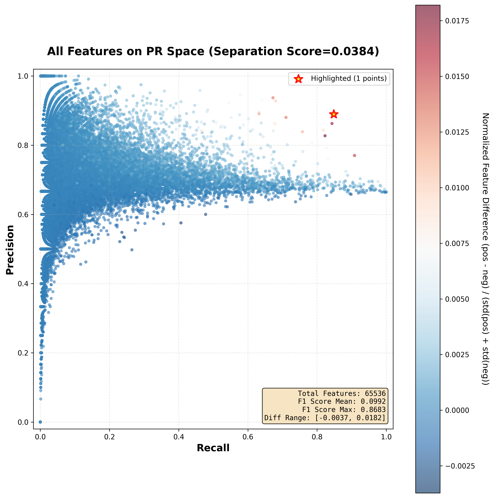
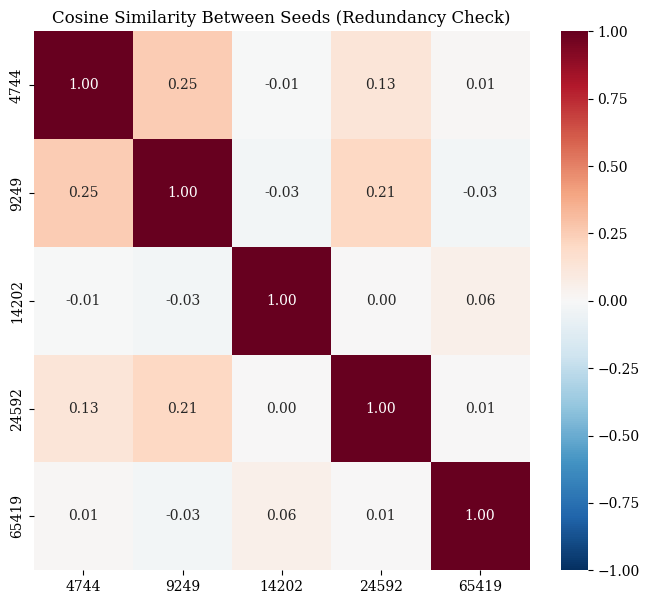
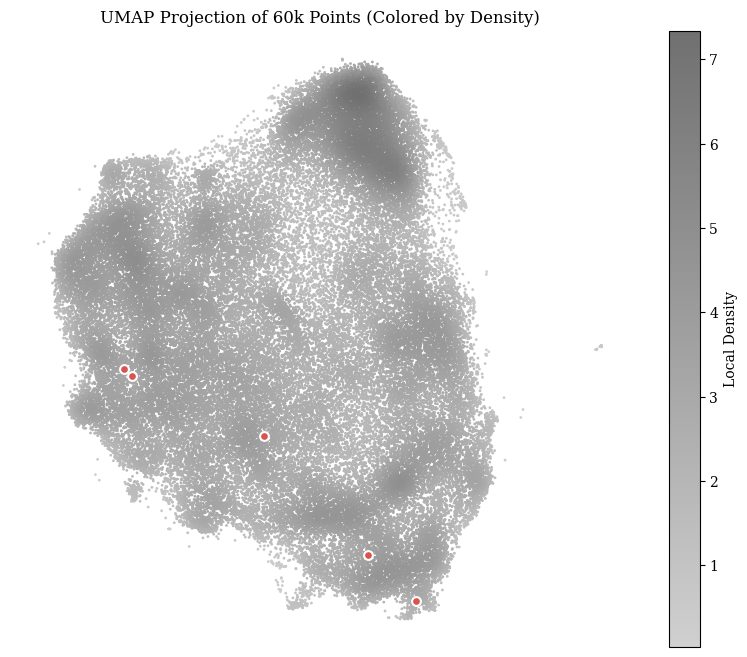

# SAE Analysis Toolkit

[](https://www.python.org/downloads/)
[](https://opensource.org/licenses/MIT)
[](https://github.com/)

A lightweight toolkit for analyzing Sparse Autoencoders (SAEs) that integrates statistical metrics, geometric analysis, and visualization dashboards.

Implemented using `sae_lens` and `transformer_lens`, this toolkit features an Anthropic-style dashboard and analysis workflow developed entirely in pure Python and Jupyter Notebooks.

> Due to the restricted network access in my experimental environment, I intentionally avoided network dependencies during development, such as port mapping (in `sae_dashboard`) and online model loading (in `transformer_lens`), which have given me a lot of trouble.






## Installation

Install this repo in editable mode:

```bash
pip install -e .
```

[rapids-ai](https://docs.rapids.ai/install/#system-req) is needed for geometric method module.

## Configuration

Create a `.env` file in the project root to configure paths:

```env
MODEL_ROOT=./models
SAE_ROOT=./sae_checkpoints
DATASET_ROOT=./datasets
```

Paths about models/saes/datasets in this repo are relative paths based on these roots. You can check your dataset config (and download datasets that fit the config) by running `download_datasets.py`.

## Module Documentation

For detailed instructions on specific modules, please refer to their internal READMEs:

* **Model & Inference**: [src/sae_tools/model/README.md](src/sae_tools/model/README.md)
* **Statistical Analysis**: [src/sae_tools/statistical/README.md](src/sae_tools/statistical/README.md)
* **Geometric Analysis**: [src/sae_tools/geometric/README.md](src/sae_tools/geometric/README.md)
* **Dashboard**: [src/sae_tools/dashboard/README.md](src/sae_tools/dashboard/README.md)

### DataLoader

For the **Data Loader** Module, refer to [src/sae_tools/data_loader/README.md](src/sae_tools/data_loader/README.md), it provides the following structure for Huggingface `Datasets`

```
prompt: str
response: str
prompt_label: Optional[str] in ["Safe", "Unsafe"]
response_label: Optional[str] in ["Safe", "Unsafe"]
category: Dict[str, float]
source: str
```

you can customize this structure by `transform` function implementation.

> TODO
> 1. classifier module
> 2. SAE realtime inference & LogitLens
> 3. batch inference in `generate_activations`